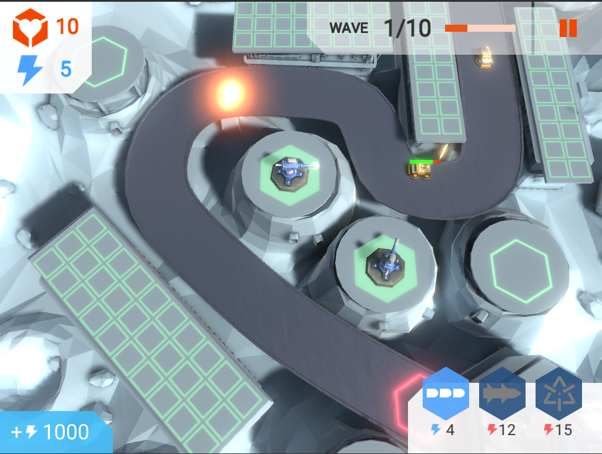

## TUTO :

Complete tuto is here :
https://learn.unity.com/project/tower-defense-template?language=en

***
Video :
[link](https://drive.google.com/open?id=16Jn1b1LqJ3PtTR6yZSTad7mvcyAGyw64 "Tower Defense")

***
Visuel :

***

Notions abordées:
* Action Game Framework : contient le code qui couve les concepts nécessaires aux jeux d'action, tels que les dommages et la logique pour la balistique et les projectiles.
* Core Framework : couvre les concepts communs aux jeux de tous les genres, tels que la sauvegarde de jeux, la gestion de données, les minuteries, les utilitaires de calcul, etc.
* SimpleAlignment ScriptableObject : est une implémentation simple de la représentation des équipes pour un jeu. Un SimpleAlignment est configuré à l'aide d'une liste d'autres SimpleAlignments qu'il considère comme des ennemis et qu'il peut attaquer et endommager. Le modèle de défense de tour inclut les deux alignements ci-dessus, mais il est possible de créer d'autres SimpleAlignments personnalisés.
* Navigation Mesh.
* Camera Rig.
* Prototype.

